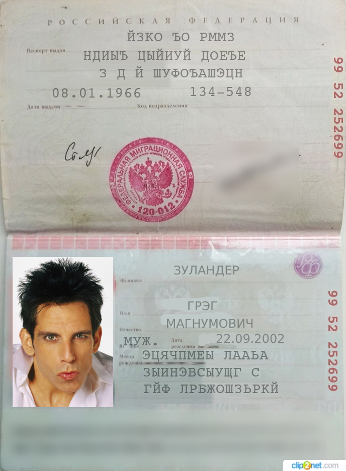

# АэроСтраж AI

Проект **"АэроСтраж AI"** автоматизирует паспортный контроль в аэропортах с помощью системы распознавания документов и биометрической верификации пассажиров. Также он упрощает проверку пользователей при покупке авиабилетов через приложение или сайт авиакомпании.

## Демо-стенд

Наше решение вы можете протестировать по ссылке:  
[http://s7.markuslons.ru/](http://s7.markuslons.ru/)

Для безопасности данных предлагаем использовать тестовые картинки, находящиеся в папке `pics`:  
- [fakepass.jpg](pics/fakepass.jpg) 
 
- [fakephoto.jpg](pics/fakephoto.jpg)  
 

## Навигация

- `/Idea` - основная идея нашего проекта  
- `/Desc` - аналитические артефакты решения  
- `/Tech` - кодовая база решения  

---
